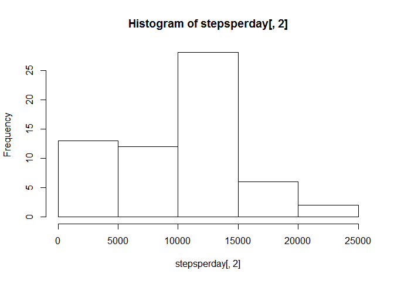
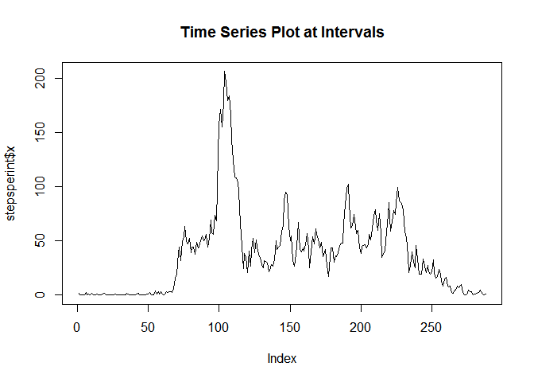
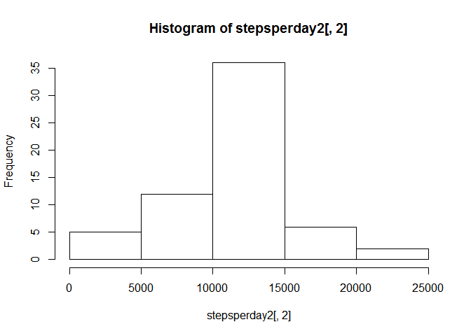
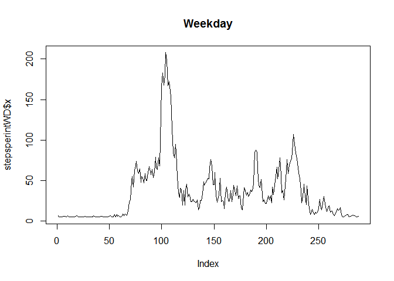
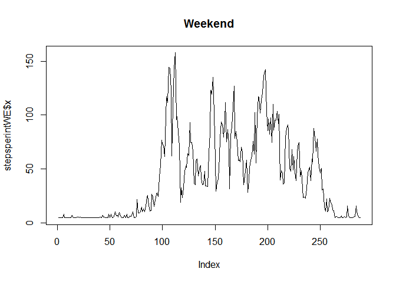

# Reproducible Research: Peer Assessment 1


Loading and preprocessing the data


```r
MyData <- read.csv("activity.csv", header=TRUE, sep=",")
```

What is mean total number of steps taken per day?


```r
#1 Calculate the total number of steps taken per day
stepsperday <- aggregate(MyData$steps, list(MyData$date), sum, na.rm=TRUE)
stepsperday
```

```
##       Group.1     x
## 1  2012-10-01     0
## 2  2012-10-02   126
## 3  2012-10-03 11352
## 4  2012-10-04 12116
## 5  2012-10-05 13294
## 6  2012-10-06 15420
## 7  2012-10-07 11015
## 8  2012-10-08     0
## 9  2012-10-09 12811
## 10 2012-10-10  9900
## 11 2012-10-11 10304
## 12 2012-10-12 17382
## 13 2012-10-13 12426
## 14 2012-10-14 15098
## 15 2012-10-15 10139
## 16 2012-10-16 15084
## 17 2012-10-17 13452
## 18 2012-10-18 10056
## 19 2012-10-19 11829
## 20 2012-10-20 10395
## 21 2012-10-21  8821
## 22 2012-10-22 13460
## 23 2012-10-23  8918
## 24 2012-10-24  8355
## 25 2012-10-25  2492
## 26 2012-10-26  6778
## 27 2012-10-27 10119
## 28 2012-10-28 11458
## 29 2012-10-29  5018
## 30 2012-10-30  9819
## 31 2012-10-31 15414
## 32 2012-11-01     0
## 33 2012-11-02 10600
## 34 2012-11-03 10571
## 35 2012-11-04     0
## 36 2012-11-05 10439
## 37 2012-11-06  8334
## 38 2012-11-07 12883
## 39 2012-11-08  3219
## 40 2012-11-09     0
## 41 2012-11-10     0
## 42 2012-11-11 12608
## 43 2012-11-12 10765
## 44 2012-11-13  7336
## 45 2012-11-14     0
## 46 2012-11-15    41
## 47 2012-11-16  5441
## 48 2012-11-17 14339
## 49 2012-11-18 15110
## 50 2012-11-19  8841
## 51 2012-11-20  4472
## 52 2012-11-21 12787
## 53 2012-11-22 20427
## 54 2012-11-23 21194
## 55 2012-11-24 14478
## 56 2012-11-25 11834
## 57 2012-11-26 11162
## 58 2012-11-27 13646
## 59 2012-11-28 10183
## 60 2012-11-29  7047
## 61 2012-11-30     0
```

```r
#2 Make a histogram of the total number of steps each day
hist(stepsperday[,2])
```

 

```r
#3 Calculate and report the mean and median of the total number of steps taken per day
mn <- mean(stepsperday[,2], na.rm=TRUE)
me <- median(stepsperday[,2], na.rm=TRUE)
print(paste0("Mean: ", mn))
```

```
## [1] "Mean: 9354.22950819672"
```

```r
print(paste0("Median: ", me))
```

```
## [1] "Median: 10395"
```

What is the average daily activity pattern?


```r
#1 Make a time series plot
stepsperint <- aggregate(MyData$steps, list(MyData$interval), mean, na.rm=TRUE)
plot(stepsperint$x, type="l", main="Time Series Plot at Intervals")
```

 

```r
#2 Which 5-min internval, on average across all the days in the dataset, contains the max num of steps?
mx <- which.max(stepsperint[,2])
print(paste0(stepsperint[mx,1], " is the max 5-min interval"))
```

```
## [1] "835 is the max 5-min interval"
```

Inputing missing values


```r
#1 Calculate num of missing values 
sum(is.na(MyData$steps))
```

```
## [1] 2304
```

```r
#2 To use mean for for replacement
#3 Create a new dataset
MyData2 <- MyData
for (i in which(sapply(MyData2, is.numeric))){
  MyData2[is.na(MyData2[,i]), i] <- mean(MyData2[,i], na.rm=TRUE)
}
#4 Make a histogram, calculate mean and median total num of steps taken per day. 
stepsperday2 <- aggregate(MyData2$steps, list(MyData2$date), sum, na.rm=TRUE)
hist(stepsperday2[,2])
```

 

```r
mn <- mean(stepsperday2[,2], na.rm=TRUE)
me <- median(stepsperday2[,2], na.rm=TRUE)
print(paste0("New Mean: ", mn))
```

```
## [1] "New Mean: 10766.1886792453"
```

```r
print(paste0("New Median: ", me))
```

```
## [1] "New Median: 10766.1886792453"
```

```r
print("Yes, different significantly from part one. It has increased the mean and median")
```

```
## [1] "Yes, different significantly from part one. It has increased the mean and median"
```

Weedays and weekends activity patterns


```r
#1 Create a new factor variable in the dataset with two levels - weekend and weekday
MyData2[,"wkday"] <- weekdays(as.Date(MyData2$date))

MyData2$wkday[MyData2$wkday=="Monday" | MyData2$wkday=="Tuesday" | MyData2$wkday=="Wednesday" | MyData2$wkday=="Thursday" | MyData2$wkday=="Friday"] <- "weekday"

MyData2$wkday[MyData2$wkday=="Saturday" | MyData2$wkday=="Sunday"] <- "weekend"

#2 plot
MyDataWD <- MyData2[MyData2$wkday=="weekday",]
stepsperintWD <- aggregate(MyDataWD$steps, list(MyDataWD$interval), mean, na.rm=TRUE)

MyDataWE <- MyData2[MyData2$wkday=="weekend",]
stepsperintWE <- aggregate(MyDataWE$steps, list(MyDataWE$interval), mean, na.rm=TRUE)

plot(stepsperintWD$x, type="l", main="Weekday")
```

 

```r
plot(stepsperintWE$x, type="l", main="Weekend")
```

 


